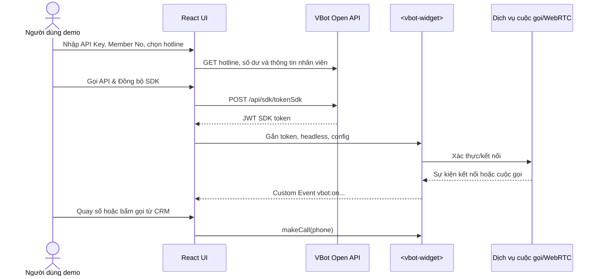
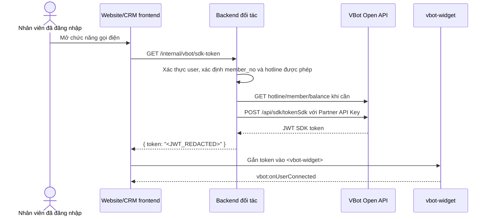

# Luồng hoạt động VBot Web SDK CRM Demo

> Phạm vi tài liệu: mô tả **đúng hành vi mã nguồn hiện tại** của demo React trong repository này, sau đó đề xuất luồng triển khai production an toàn hơn cho website/CRM của đối tác. Ví dụ chỉ dùng khóa, token và số điện thoại giả.

## 1. Mục đích và kiến trúc tổng quan

Demo mô phỏng một CRM có thể:

- dùng Partner API Key để chuẩn bị một tài khoản SDK (`member_no`) và lấy JWT SDK token;
- khởi tạo Web Component `<vbot-widget>` bằng token đó;
- quay số, click-to-call từ danh bạ, nhận cuộc gọi và điều khiển cuộc gọi;
- minh họa kiểm tra/nạp số dư cho tài khoản SDK.



### Thành phần mã nguồn chính

| Thành phần | Trách nhiệm |
| --- | --- |
| `src/App.tsx` | Giữ token/trạng thái kết nối/cuộc gọi; render `<vbot-widget>`; gọi các phương thức SDK và lắng nghe event. |
| `src/components/SettingsPage.tsx` | Màn hình trong ảnh: nhập API Key, tải hotline/số dư, lấy token SDK, nạp/trừ tiền và hiển thị cURL/response. |
| `src/components/CRMTable.tsx` | Danh bạ demo và nút click-to-call. |
| `src/components/DialerDropdown.tsx` | Bàn phím quay số tùy biến cho Headless mode. |
| `src/components/ActiveCallWidget.tsx`, `IncomingCallModal.tsx` | UI điều khiển cuộc gọi và popup cuộc gọi đến trong Headless mode. |
| `src/components/NotebookGuide.tsx` | Màn “Hướng dẫn tích hợp” có các ví dụ backend/frontend cho HTML, React, Vue và Svelte. |
| `public/vbot-sdk.umd.js` | Bundle Web SDK được `index.html` nạp trước khi React khởi động. |

## 2. Cấu hình, dữ liệu lưu cục bộ và trạng thái

### 2.1. Biến môi trường

File `.env` hiện cấu hình:

| Biến | Giá trị/hành vi hiện tại | Mục đích |
| --- | --- | --- |
| `VITE_API_BASE_URL` | `https://open-api-staging.vbot.vn/v3.0` | Base URL cho các API ở màn Cấu hình và thuộc tính `base-url` của widget. Nếu không có, `SettingsPage` vẫn dùng staging URL này làm fallback. |
| `VITE_VBOT_ACCESS_TOKEN` | rỗng mặc định | Có thể cung cấp SDK token mặc định khi chạy demo; token trong `localStorage` được ưu tiên hơn. |

### 2.2. Dữ liệu được lưu trong `localStorage`

| Khóa | Khi nào ghi/đọc | Ý nghĩa |
| --- | --- | --- |
| `vbot_partner_key` | Ghi ngay khi người dùng đổi ô API Key; đọc khi mở màn Cấu hình. | Partner API Key của demo. |
| `vbot_available_hotlines` | Ghi sau khi tải hotline thành công; đọc khi khởi tạo màn Cấu hình. | Danh sách hotline cache. |
| `vbot_selected_hotlines` | Ghi khi thay đổi checkbox/ô hotline; đọc khi khởi tạo màn Cấu hình. | Danh sách `hotline_code` đã chọn. |
| `vbot_access_token` | Ghi sau khi `tokenSdk` thành công; đọc khi App mount. | JWT dùng để khởi tạo SDK. |
| `vbot_integration_mode` | Ghi sau khi đồng bộ SDK; đọc khi App mount. | `builtin` hoặc `headless`. |
| `vbot_auto_connect` | Ghi `true` khi kết nối và `false` khi ngắt kết nối. | Quyết định có tự kết nối lại từ token đã lưu hay không. |
| `vbot_tour_skipped` | Ghi khi đóng/bỏ qua tour. | Không hiển thị tour tự động trong các lần sau. |

> Cảnh báo: đây là hành vi tiện cho demo. `localStorage` có thể bị đọc bởi JavaScript chạy cùng origin; không nên lưu Partner API Key trong trình duyệt production. Token SDK cũng phải được coi là thông tin nhạy cảm, có thời hạn ngắn và không ghi vào log/URL.

### 2.3. Vòng đời kết nối

1. Khi `App` mount, ứng dụng lấy token ở `vbot_access_token`; nếu không có mới dùng `VITE_VBOT_ACCESS_TOKEN`.
2. Nếu có token và được phép auto-connect, `activeToken` được gán token, trạng thái chuyển sang **Đang tự kết nối...**.
3. JSX render `<vbot-widget>` với `key` dựa trên token và mode. Khi token/mode đổi, React tạo widget mới.
4. Widget phát event `vbot:onUserConnected` thì UI hiện **Trực tuyến**; các event ngắt kết nối đưa UI về **Ngoại tuyến/Mất kết nối**.
5. Khi lỗi kết nối (`vbot:onUserConnectionFailed`), demo hiện `alert`, gọi hàm ngắt kết nối và đặt `vbot_auto_connect=false`.

Các trạng thái UI gồm `offline`, `connecting`, `online`; trạng thái cuộc gọi gồm `idle`, `ringing`, `talking`, `failed`.

## 3. Luồng chi tiết của màn “Cấu hình SDK”

### Bước 1 — Chọn cơ chế tích hợp giao diện

Người dùng chọn một trong hai giá trị ở **Cơ chế tích hợp giao diện (UI)**:

| Lựa chọn | Widget nhận gì | Hành vi demo |
| --- | --- | --- |
| **Built-in Native UI** (`builtin`, mặc định) | Không có thuộc tính `headless`. | SDK hiển thị UI có sẵn. Nút Quay số/FAB gọi `showCallUI()` để mở UI SDK; click-to-call gọi `makeCall(phone)`. |
| **Headless Custom UI** (`headless`) | `headless="true"`. | SDK xử lý kết nối/cuộc gọi nhưng React tự vẽ bàn phím, popup cuộc gọi đến và bảng điều khiển cuộc gọi. |

Thao tác chọn mode **chưa gọi API**. Giá trị chỉ được lưu bền khi người dùng bấm **Gọi API & Đồng bộ SDK** và nhận token thành công.

### Bước 2 — Dán Partner API Key và bấm “Tải Dữ Liệu”

1. Người dùng dán Partner API Key vào ô mật khẩu **VBot Partner API Key**.
2. Demo lập tức ghi giá trị vào `localStorage.vbot_partner_key`; thao tác gõ không gọi API.
3. Bấm **Tải Dữ Liệu**. Nút bị vô hiệu hóa khi đang tải hotline hoặc số dư.
4. Demo gọi song song theo thứ tự khởi phát hai luồng dưới đây. Nếu trước đó API Key đã được lưu, cùng hai luồng cũng được gọi khi mở lại trang Cấu hình (hotline chỉ tải khi chưa có cache).

#### 2A. Tải danh sách hotline

```http
GET {VITE_API_BASE_URL}/api/hotline/getAll
X-API-Key: <PARTNER_API_KEY>
Accept: application/json
```

| Mục | Chi tiết |
| --- | --- |
| Mục đích | Lấy hotline hợp lệ để người dùng chọn chính xác `hotline_code` cho SDK. |
| Đầu vào | Partner API Key trong header. |
| Thành công | `result.error === 0` và `result.data` là mảng hotline. |
| Kết quả UI | Hiện danh sách checkbox với `hotline_name`, `hotline_number`, `hotline_type`; cache mảng vào `vbot_available_hotlines`. |
| Thất bại | Hiện `alert` có message API; lỗi mạng/CORS hiện alert yêu cầu kiểm tra Key hoặc CORS. |

Mỗi chọn/bỏ chọn checkbox chỉ sửa `selectedHotlines` và cache `vbot_selected_hotlines`; **không gọi API ngay**. Nếu không tải được hotline/có cache rỗng, UI cho nhập các hotline code bằng dấu phẩy.

#### 2B. Tải số dư admin và chi tiết/số dư nhân viên

```http
GET {VITE_API_BASE_URL}/api/account/balance
X-API-Key: <PARTNER_API_KEY>
Accept: application/json
```

Tiếp theo, nếu ô **Mã nhân viên (Member No)** không rỗng, demo gọi:

```http
GET {VITE_API_BASE_URL}/api/member/getByMemberNo?member_no=<MEMBER_NO>
X-API-Key: <PARTNER_API_KEY>
Accept: application/json
```

| Mục | Chi tiết |
| --- | --- |
| Mục đích | API thứ nhất lấy số dư tài khoản admin; API thứ hai kiểm tra nhân viên, số dư (`member_money`) và thông tin hiển thị. |
| Thành công | `error === 0`. Với member API, response cần có `data`. |
| Kết quả UI | Card **Số dư Admin**, **Số dư Nhân viên** và **Chi tiết nhân viên** được cập nhật. Khi không tìm thấy member, số dư member được đặt về `0`, chi tiết bị xóa. |
| Thất bại | Lỗi chỉ được ghi `console.error`; UI giữ hoặc hiển thị dữ liệu hiện có. |

> Lưu ý refactor: đổi ô Member No không tự tải lại dữ liệu. Người dùng cần bấm **Tải Dữ Liệu** hoặc **Cập nhật số dư** để truy vấn member mới.

### Bước 3 — Nhập Member No và chọn hotline

1. Nhập mã định danh nhân viên ở **Mã nhân viên (Member No)**, ví dụ `agent_001`.
2. Chọn ít nhất một hotline trong danh sách; trong luồng fallback, nhập một hoặc nhiều `hotline_code` cách nhau bằng dấu phẩy.
3. Những giá trị này là dữ liệu chuẩn bị cho `POST /api/sdk/tokenSdk` ở bước kế tiếp. Demo không ép buộc phải chọn hotline ở phía client; API/hệ thống VBot là nơi quyết định tính hợp lệ.

### Bước 4 — Bấm “Gọi API & Đồng bộ SDK” để lấy token

Demo kiểm tra trước khi gọi:

- Partner API Key không được rỗng;
- Member No không được rỗng.

Sau đó tạo request body:

```json
{
  "member_no": "agent_001",
  "hotline_codes": ["hotline_main"]
}
```

và gọi API:

```http
POST {VITE_API_BASE_URL}/api/sdk/tokenSdk
Content-Type: application/json
X-API-Key: <PARTNER_API_KEY>

{
  "member_no": "agent_001",
  "hotline_codes": ["hotline_main"]
}
```

| Mục | Chi tiết |
| --- | --- |
| Mục đích | Cấp/lấy JWT token dùng riêng cho Web SDK của nhân viên và hotline đã chọn. |
| Điều kiện demo coi là thành công | `result.error === 0` và `result.data` có giá trị token. |
| Kết quả UI | Toàn bộ JSON response được hiện trong **Chi tiết API (CURL & Response)**; `result.data` được chuyển vào `onConnect`; trạng thái chuyển **Đang kết nối...**. |
| Kết quả trong App | Lưu token/mode/auto-connect vào `localStorage`, gán `activeToken`, render lại `<vbot-widget>` và chờ event kết nối. |
| Bước tiếp theo tự động | Gọi lại `fetchBalances()` để cập nhật số dư/chi tiết member. |
| Lỗi nghiệp vụ | Hiện `alert` với `result.message` (hoặc “Lỗi không xác định”). |
| Lỗi mạng/CORS | Ghi response mô phỏng `{ error: 500, ... }` vào khung API, hiện alert kiểm tra CORS/Network. |

Khung **Chi tiết API (CURL & Response)** luôn có cURL của request token hiện tại. Ví dụ cURL chỉ chèn placeholder `<PARTNER_API_KEY>`, không in khóa thật.

### Bước 5 — Kiểm tra số dư, nạp tiền hoặc trừ tiền

**Cập nhật số dư** gọi lại hai API GET ở bước 2B.

Để nạp/trừ tiền, người dùng nhập số tiền dương rồi bấm **Nạp tiền** hoặc **Trừ tiền**. Demo kiểm tra API Key, Member No và `moneyToAdd > 0`, rồi gọi:

```http
POST {VITE_API_BASE_URL}/api/member/addMoney
Content-Type: application/json
X-API-Key: <PARTNER_API_KEY>

{
  "member_no": "agent_001",
  "money": 1000
}
```

- Với **Nạp tiền**, `money` là số dương.
- Với **Trừ tiền**, demo gửi cùng độ lớn nhưng đổi dấu âm, ví dụ `-1000`.
- Khi `result.error === 0`, demo hiện alert thành công và gọi `fetchBalances()` ngay.
- Khi API trả lỗi, demo hiện `result.message`; khi lỗi mạng/CORS, hiện alert tương ứng.

Card chi tiết nhân viên hiển thị tên, máy nhánh, Member No, số dư, hotline người dùng đang chọn và ngày hết hạn. Đây là dữ liệu UI; hotline hiển thị lấy từ lựa chọn local hiện tại, không phải một lần truy vấn riêng để xác thực mapping sau mỗi lần chọn.

### Bước 6 — Ngắt kết nối

Nút **Ngắt kết nối** chỉ hiện khi trạng thái khác `offline`. Demo:

1. xóa `activeToken` trong state (widget được render lại với token rỗng);
2. ghi `vbot_auto_connect=false`;
3. đặt trạng thái offline, xóa call session, dừng timer và đóng popup cuộc gọi đến.

Token đã lưu trong `vbot_access_token` **không bị xóa**. Vì auto-connect bị đặt `false`, lần tải lại trang tiếp theo không tự dùng token đó; người dùng vẫn có thể lấy token/kết nối lại bằng luồng đồng bộ.

## 4. Luồng sử dụng sau khi SDK kết nối

### 4.1. Widget được khởi tạo thế nào

Sau khi token thành công, `App.tsx` render custom element tương đương:

```tsx
<vbot-widget
  key={`${activeToken || 'empty'}-${mode}`}
  ref={widgetRef}
  token={activeToken || ''}
  headless={mode === 'headless' ? 'true' : undefined}
  config={JSON.stringify(widgetConfig)}
  base-url={import.meta.env.VITE_API_BASE_URL}
/>
```

`config` hiện dùng để đặt vị trí/margin cho các overlay `dialpad`, `calling`, `incoming`. Built-in mode mở từ header ở góc trên phải; mở từ FAB ở góc dưới phải.

### 4.2. Quay số và gọi đi

| Thao tác người dùng | Built-in Native UI | Headless Custom UI | Lệnh/API thực tế |
| --- | --- | --- | --- |
| Bấm **Quay số** trên header | Cập nhật vị trí overlay, sau 50 ms gọi `widgetRef.current.showCallUI()`. | Mở `DialerDropdown` ở phía trên. | Phương thức SDK `showCallUI()` chỉ ở Built-in. Không gọi Open API. |
| Bấm FAB bàn phím số | Mở UI SDK tại góc dưới phải. | Mở `DialerDropdown` ở phía dưới. | Như trên. |
| Nhập số và bấm **Gọi điện** trong dialer headless | Không áp dụng. | Dialer kiểm tra số không rỗng, gọi callback `initiateCall(phone)`. | `widgetRef.current.makeCall(phone)`. |
| Bấm biểu tượng gọi ở một liên hệ CRM | Gọi số liên hệ bằng SDK native. | Mở trạng thái/widget gọi tùy biến. | `widgetRef.current.makeCall(phone)`. |

Nếu chưa có `activeToken`, click-to-call sẽ alert “Vui lòng cấu hình...” và chuyển về màn Cấu hình. Nút header/FAB còn hiện tooltip dẫn đến **Cấu hình ngay**, nhưng ở Built-in mode vẫn thử mở `showCallUI()`; nếu widget chưa sẵn sàng sẽ hiện alert.

Trong danh bạ:

- **Thêm liên hệ** chỉ thêm bản ghi vào React state trong phiên hiện tại, không gọi CRM API và không lưu sau refresh.
- Form bắt buộc tên và số điện thoại; email, khu vực, tag là tùy chọn.
- Click biểu tượng gọi của một liên hệ gọi `onCallContact(contact.phone)`; số mẫu có thể được che trên UI nhưng giá trị thực trong state được gửi cho callback.

### 4.3. Event từ widget và trạng thái cuộc gọi

`App.tsx` gắn và dọn event listener theo vòng đời widget. Dữ liệu cuộc gọi mà App hiện dùng đọc từ `event.detail.callData`.

| Event | Demo xử lý | Tác động UI |
| --- | --- | --- |
| `vbot:onUserConnected` | Đặt kết nối `online`. | “Trực tuyến”. |
| `vbot:onDisconnected` | Đặt offline/mất kết nối. | “Mất kết nối”. |
| `vbot:onUserDisconnected` | Đặt offline. | “Ngoại tuyến”. |
| `vbot:onUserConnectionFailed` | Lấy `event.detail.error`, alert và ngắt kết nối. | Hiện lỗi rồi offline. |
| `vbot:onCallIncoming` | Lấy `callData.phoneNumber`, lưu session; nếu Headless thì mở modal. | Headless hiện popup nhận/từ chối. |
| `vbot:onCallProgress` | Cập nhật số và trạng thái `ringing`. | “Đang đổ chuông...”. |
| `vbot:onCallAccepted` | Cập nhật session, chuyển `talking`, khởi động timer. | “Đang đàm thoại”, hiển thị thời lượng. |
| `vbot:onCallEnded` | Xóa session, dừng timer, đóng modal. | Ẩn panel/popup call. |
| `vbot:onCallFailed` | Chuyển `failed`, sau 2 giây reset về idle. | Hiện “Thất bại” ngắn hạn. |

### 4.4. Nhận và điều khiển cuộc gọi trong Headless mode

Trong Headless mode, UI tùy biến gọi trực tiếp các method sau của widget/session:

| Thao tác | Lệnh | Ghi chú |
| --- | --- | --- |
| Trả lời cuộc gọi đến | `widgetRef.current.answerCall()` | Modal bị đóng trước khi gọi SDK. |
| Từ chối/gác máy cuộc gọi đến | `widgetRef.current.hangupCall()` | Modal bị đóng trước khi gọi SDK. |
| Gác máy | `widgetRef.current.hangupCall()` | Demo cũng tự reset state/timer ngay, kể cả khi event kết thúc chưa về. |
| Tắt/mở mic | `callSession.session.mute({ audio: true })` hoặc `.unmute({ audio: true })` | Chỉ thực hiện khi `callSession.session` tồn tại. |
| Giữ/tiếp tục | `callSession.session.hold()` hoặc `.unhold()` | Chỉ thực hiện khi có session. |
| Gửi DTMF | `widgetRef.current.sendDTMF(key)` | Các phím: `0-9`, `*`, `#`. |

Trong Built-in mode, các thao tác hiển thị/điều khiển được giao cho UI của SDK nên các component React tùy biến trên không được render.

## 5. Tổng hợp Open API mà demo gọi trực tiếp

Base URL: `VITE_API_BASE_URL`, hiện trỏ đến `https://open-api-staging.vbot.vn/v3.0`.

| Endpoint | Method | Xác thực trong `SettingsPage` | Dữ liệu gửi | Mục đích/khi gọi |
| --- | --- | --- | --- | --- |
| `/api/hotline/getAll` | `GET` | `X-API-Key`, `Accept: application/json` | Không có body | Tải hotline khi bấm Tải Dữ Liệu hoặc lúc mở cấu hình chưa có cache. |
| `/api/account/balance` | `GET` | `X-API-Key`, `Accept: application/json` | Không có body | Lấy số dư admin. |
| `/api/member/getByMemberNo?member_no=...` | `GET` | `X-API-Key`, `Accept: application/json` | Query `member_no` | Lấy/suy ra số dư và chi tiết nhân viên. |
| `/api/member/addMoney` | `POST` | `X-API-Key`, `Content-Type: application/json` | `{ member_no, money }` | Nạp/trừ tiền mô phỏng. |
| `/api/sdk/tokenSdk` | `POST` | `X-API-Key`, `Content-Type: application/json` | `{ member_no, hotline_codes }` | Lấy JWT token để cấp cho `<vbot-widget>`. |

## 6. Các điểm cần lưu ý khi refactor

1. **API Key đang chạy ở frontend.** `SettingsPage.tsx` gọi Open API trực tiếp bằng `X-API-Key`; điều này phù hợp thử nghiệm nhưng không an toàn khi public website.
2. **Màn Hướng dẫn hiện có không hoàn toàn khớp runtime.** `NotebookGuide.tsx` mô tả việc backend gọi `tokenSdk` và ví dụ dùng `Authorization: Bearer ...`, trong khi luồng đang chạy dùng `X-API-Key`. Khi refactor, chọn một quy ước header theo tài liệu Open API chính thức rồi dùng thống nhất ở backend và tài liệu.
3. **Payload event được dùng không thống nhất.** `App.tsx` dùng `event.detail.callData.phoneNumber`, nhưng ví dụ rút gọn ở màn hướng dẫn có chỗ đọc `event.detail.phoneNumber`. Phần tích hợp nên chuẩn hóa một kiểu TypeScript/event adapter sau khi xác nhận SDK version.
4. **Token/key đang tồn tại lâu trong trình duyệt.** Tách UI demo khỏi cơ chế credential production; không hiển thị toàn bộ response token trong UI/log production.
5. **Các filter CRM, profile và danh bạ chỉ là mock UI.** Không có API tìm kiếm/lưu liên hệ/xóa bộ lọc phía sau chúng.
6. **Đổi Member No hoặc mode không tự đồng bộ ngay.** Refactor UI nên nói rõ hành động tiếp theo (tải lại dữ liệu/nhận token mới) và vô hiệu hóa các hành động gọi khi widget chưa online.

## 7. Luồng production được khuyến nghị

### 7.1. Nguyên tắc phân tách trách nhiệm

| Tầng | Được phép giữ | Không được đưa ra public client |
| --- | --- | --- |
| Backend đối tác | Partner API Key, mapping người dùng đăng nhập ↔ `member_no`, chính sách hotline/số dư, audit log. | Không trả Partner API Key cho frontend. |
| Frontend đối tác | SDK token ngắn hạn của user hiện tại, trạng thái/UI cuộc gọi. | Không gọi Open API VBot bằng Partner API Key; không tự chọn `member_no` của người khác. |
| VBot Web SDK | SDK token và cấu hình UI cần thiết. | Không nhận Partner API Key. |



### 7.2. Backend cấp token đề xuất

1. Frontend gọi endpoint nội bộ, ví dụ `GET /internal/vbot/sdk-token`; endpoint này yêu cầu session/JWT của hệ thống đối tác.
2. Backend xác định `member_no` từ người dùng đã xác thực, thay vì nhận tự do từ client.
3. Backend lấy danh sách hotline được phép từ cấu hình hệ thống của đối tác. Nếu cần lựa chọn động, backend kiểm tra lựa chọn đó trước khi gọi VBot.
4. Backend dùng Partner API Key trong secret manager/environment server để gọi `POST /api/sdk/tokenSdk` theo quy ước xác thực đã xác nhận với VBot.
5. Trước khi cấp token hoặc khi SDK báo lỗi gọi, backend có thể kiểm tra member/hotline/số dư. Nếu chính sách cho phép, backend thực hiện JIT provisioning: nạp tiền bằng `POST /api/member/addMoney` và gán hotline theo API VBot được hỗ trợ.
6. Backend chỉ trả token SDK cần thiết, thời hạn ngắn; frontend thay widget khi token hết hạn/đổi nhân viên.
7. Backend ghi audit log không nhạy cảm: user nội bộ, Member No, hotline code, thời điểm, mã lỗi. Không ghi Partner API Key hoặc JWT đầy đủ.

> Điều kiện nghiệp vụ mà màn hướng dẫn hiện có nêu ra: nhân viên cần có ít nhất một hotline hoạt động và số dư lớn hơn 0 để gọi. Cần xác nhận lại bằng tài liệu Open API/môi trường VBot trước khi biến thành rule cứng trong production.

### 7.3. Ví dụ backend Node.js (minh họa)

Ví dụ dưới đây thể hiện nguyên tắc giữ Partner API Key ở server. Header xác thực cần được đồng bộ với tài liệu Open API/version SDK đã chốt; mã demo hiện tại sử dụng `X-API-Key`.

```ts
app.get('/internal/vbot/sdk-token', requireAuthenticatedUser, async (req, res) => {
  const memberNo = await memberRepository.getVbotMemberNo(req.user.id);
  const hotlineCodes = await policyService.getAllowedHotlineCodes(req.user.id);

  if (!memberNo || hotlineCodes.length === 0) {
    return res.status(422).json({ message: 'Tài khoản chưa sẵn sàng gọi điện.' });
  }

  const vbotResponse = await fetch(`${process.env.VBOT_API_BASE_URL}/api/sdk/tokenSdk`, {
    method: 'POST',
    headers: {
      'Content-Type': 'application/json',
      'X-API-Key': process.env.VBOT_PARTNER_API_KEY!,
    },
    body: JSON.stringify({ member_no: memberNo, hotline_codes: hotlineCodes }),
  });
  const payload = await vbotResponse.json();

  if (!vbotResponse.ok || payload.error !== 0 || !payload.data) {
    return res.status(502).json({ message: 'Không thể cấp token gọi điện.' });
  }

  res.set('Cache-Control', 'no-store');
  return res.json({ token: payload.data });
});
```

## 8. Nhúng SDK vào website đối tác sau khi lấy token

### 8.1. HTML thuần

Nạp bundle SDK trước, lấy token từ **backend nội bộ** sau khi user đăng nhập, rồi gán token cho custom element.

```html
<script src="https://cdn.vbot.vn/vbot-sdk/vbot-sdk.umd.js" defer></script>

<button id="call-customer">Gọi khách hàng</button>
<vbot-widget id="vbot-widget"></vbot-widget>

<script>
  async function initializeVbot() {
    const response = await fetch('/internal/vbot/sdk-token', {
      credentials: 'include'
    });
    if (!response.ok) throw new Error('Không lấy được SDK token');

    const { token } = await response.json();
    const widget = document.querySelector('#vbot-widget');
    widget.setAttribute('token', token);

    widget.addEventListener('vbot:onUserConnected', () => {
      console.log('SDK đã trực tuyến');
    });

    widget.addEventListener('vbot:onCallIncoming', (event) => {
      const callData = event.detail?.callData;
      console.log('Cuộc gọi đến:', callData?.phoneNumber);
    });

    document.querySelector('#call-customer').addEventListener('click', () => {
      widget.makeCall('0900000000');
    });
  }

  initializeVbot().catch((error) => console.error('Khởi tạo VBot thất bại', error));
</script>
```

Để dùng UI mặc định, không đặt `headless`. Nếu muốn đặt overlay ở vị trí xác định, truyền thuộc tính `config` là chuỗi JSON theo cấu hình SDK đã được xác nhận.

### 8.2. React

**Khai báo custom element cho TypeScript** (ví dụ `src/vite-env.d.ts`):

```ts
import React from 'react';

declare global {
  namespace JSX {
    interface IntrinsicElements {
      'vbot-widget': React.DetailedHTMLProps<React.HTMLAttributes<HTMLElement>, HTMLElement> & {
        token?: string;
        headless?: string;
        config?: string;
        'base-url'?: string;
        ref?: React.RefObject<any>;
      };
    }
  }
}
```

**Component sử dụng token do backend nội bộ cấp**:

```tsx
import { useEffect, useRef, useState } from 'react';

export function VbotPhone() {
  const widgetRef = useRef<any>(null);
  const [token, setToken] = useState<string>();
  const [online, setOnline] = useState(false);

  useEffect(() => {
    fetch('/internal/vbot/sdk-token', { credentials: 'include' })
      .then((response) => {
        if (!response.ok) throw new Error('Không lấy được SDK token');
        return response.json();
      })
      .then(({ token }) => setToken(token));
  }, []);

  useEffect(() => {
    const widget = widgetRef.current;
    if (!widget) return;

    const onConnected = () => setOnline(true);
    const onDisconnected = () => setOnline(false);
    const onIncoming = (event: CustomEvent) => {
      console.log(event.detail?.callData?.phoneNumber);
    };

    widget.addEventListener('vbot:onUserConnected', onConnected);
    widget.addEventListener('vbot:onUserDisconnected', onDisconnected);
    widget.addEventListener('vbot:onCallIncoming', onIncoming);
    return () => {
      widget.removeEventListener('vbot:onUserConnected', onConnected);
      widget.removeEventListener('vbot:onUserDisconnected', onDisconnected);
      widget.removeEventListener('vbot:onCallIncoming', onIncoming);
    };
  }, [token]);

  return (
    <>
      <button disabled={!online} onClick={() => widgetRef.current?.makeCall('0900000000')}>
        Gọi khách hàng
      </button>
      {token && <vbot-widget key={token} ref={widgetRef} token={token} />}
    </>
  );
}
```

- `key={token}` bảo đảm widget được tạo mới khi backend trả token mới, tương tự demo hiện tại.
- Chỉ gọi `makeCall` sau `vbot:onUserConnected` để UI không gọi quá sớm.
- Luôn gỡ event listener khi component unmount hoặc token thay đổi.
- Khi token hết hạn, lấy token mới từ backend rồi thay state `token`; không dùng Partner API Key ở React.

### 8.3. Headless mode trong website đối tác

Nếu đối tác tự thiết kế toàn bộ call UI, render:

```tsx
<vbot-widget ref={widgetRef} token={token} headless="true" />
```

Sau đó dùng các method đã xuất hiện trong demo:

```ts
widgetRef.current?.makeCall('0900000000');
widgetRef.current?.answerCall();
widgetRef.current?.hangupCall();
widgetRef.current?.sendDTMF('1');
```

Các hàm mute/hold trong demo gọi vào `event.detail.callData.session`. Vì đây là object nhận từ event SDK, cần kiểm tra null và xác nhận TypeScript contract của đúng SDK version trước khi đưa vào shared UI component.

### 8.4. Vue và Svelte (phụ lục nhanh)

**Vue:** cấu hình compiler xem tiền tố `vbot-` là custom element; bind `ref` và `:token`.

```vue
<vbot-widget ref="widgetRef" :token="token" />
```

Gắn/gỡ event bằng `onMounted`/`onUnmounted`, gọi `widgetRef.value?.makeCall('0900000000')` khi đã kết nối.

**Svelte:** bind node DOM bằng `bind:this`.

```svelte
<vbot-widget bind:this={widgetEl} token={token}></vbot-widget>
```

Gắn event trong `onMount`, return cleanup để `removeEventListener`, rồi gọi `widgetEl?.makeCall('0900000000')`.

## 9. Checklist nghiệm thu/refactor UI

- [ ] Mỗi thao tác cần API nói rõ dữ liệu bắt buộc, trạng thái loading, kết quả và lỗi có thể hành động.
- [ ] Không hiển thị hoặc lưu Partner API Key ở frontend production.
- [ ] UI phân biệt rõ ba pha: chuẩn bị tài khoản/hotline → lấy token → SDK trực tuyến và có thể gọi.
- [ ] UI không cho gọi trước event `vbot:onUserConnected`; giải thích quyền microphone và lỗi kết nối rõ ràng.
- [ ] Built-in và Headless có mô tả riêng để user hiểu khác biệt về trách nhiệm UI.
- [ ] Chuẩn hóa header xác thực Open API và cấu trúc payload event với tài liệu SDK/version đang phát hành trước khi refactor hoàn tất.
- [ ] Không đưa token, API Key hoặc số điện thoại thực vào screenshot, cURL, log hay telemetry.

